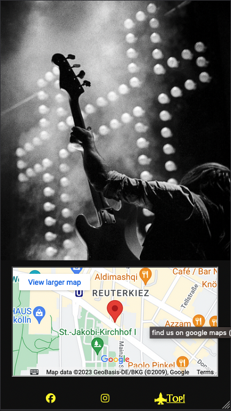
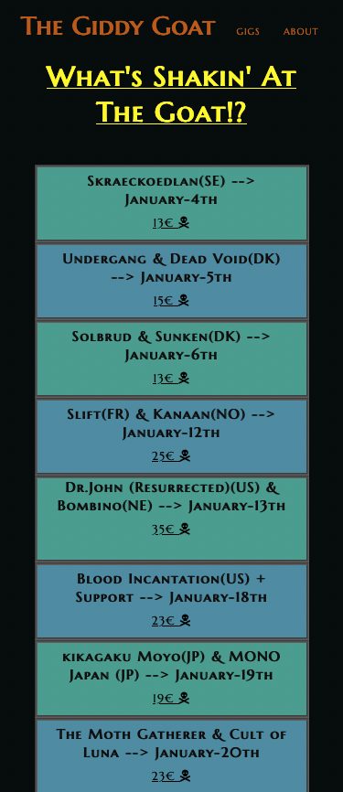
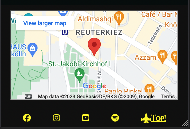
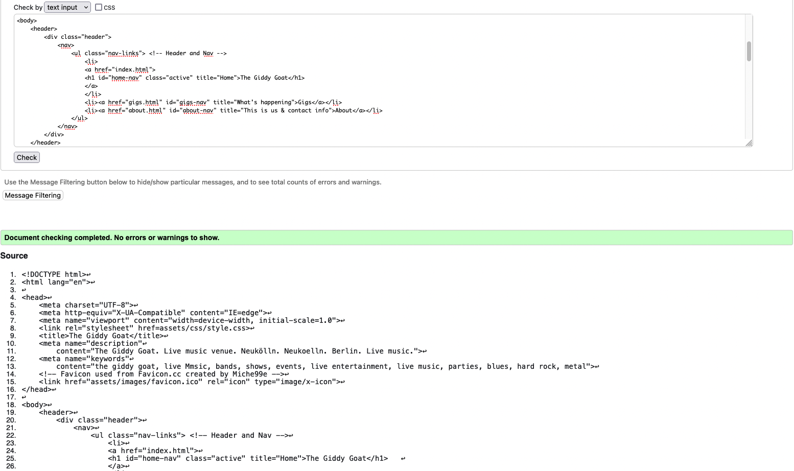
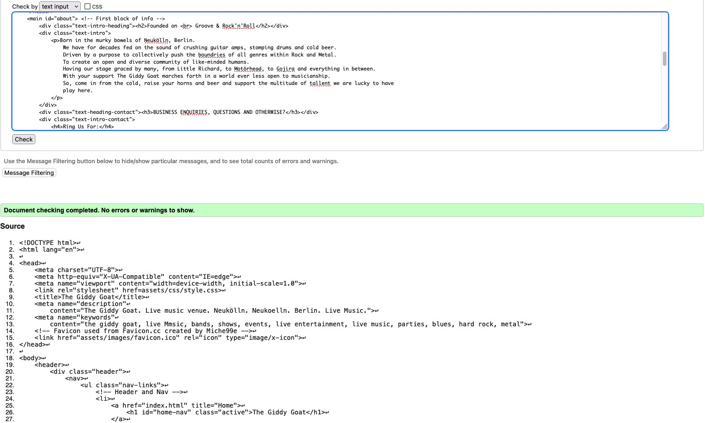
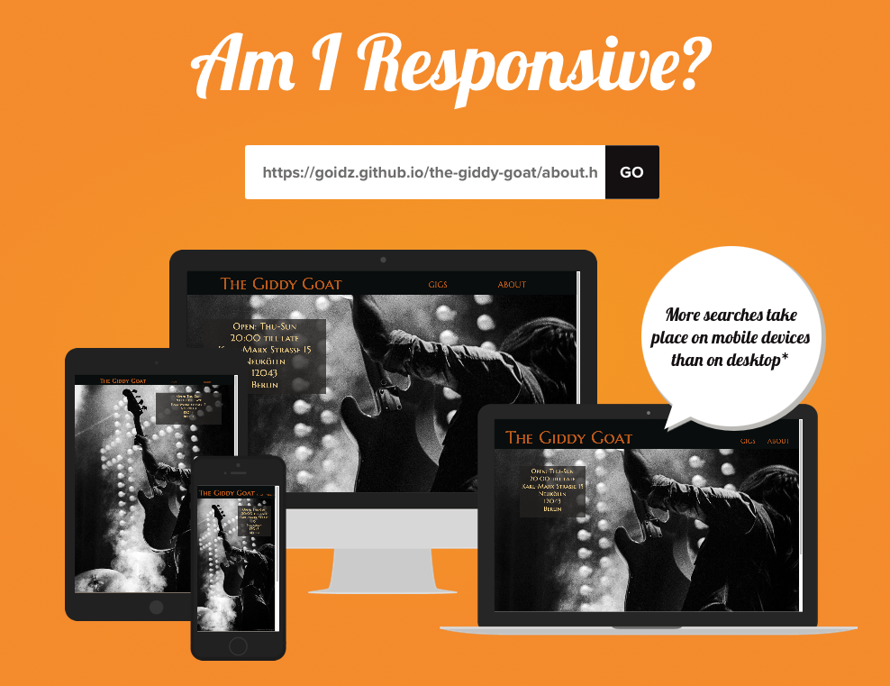

# The Giddy Goat.
This is my portfolio project for the Code Institute Full-stack developer course.

The Giddy Goat is a fictitious live music venue. The aim of this website is to attempt to show what a music venue's website should look like from the perspective of a live music lover and hopefully also other like-minded individuals. I aimed to create a website that is easy to navigate and quickly gives the information most important to the user and in turn encourage repeat use. Through sharing the website with other people I have gotten very positive feedback with the only critique being the lack of a drinks and/or food menu. Unfortunately I have not had the time to implement this.

[Welcome to The Giddy Goat](https://goidz.github.io/the-giddy-goat/index.html)

## Layout and features.
The website consists of three seperate pages all are accessed by a navigation bar at the top of the home-page.

### Home-page.
At the top of the home-page is the navigation bar. The venue title also acts as navigation back to the home-page. To the right is the gigs-page and about-page headings which links to their respective pages. A title attribute is embedded in each giving the user information on page location when hovered by a mouse.
Underneath the navigation bar is the main image. It strives to set the tone of the venue and websit and hopefully is striking enough to encourage the user to explore further.
Layered atop the main image is the address and further down the page the user can find Google Maps that also links to said page.
The bottom of the page consist of functioning social media icons and an icon that links back to the top of the page. All the icons were created using Fontawesome.com. (All the icons are linked to home-pages of the websites they represent because it's a fictitious establishment)

  

### Gigs-page.
When the gigs-page is selected it navigates to the venues events section. All the events are placed in a column and has a link to a ticket website. (In this case to eventim.de) I selected the fonts of the events rows using the randomised pallets on Venngage.com. The choices were based on trying to make the site easier to use for the visually impaired. At the bottom of the page Google-maps can again be found and underneath that again the social media icons. In addition to these icons there's also Spotify and YouTube to assist and encourage users to discover new music. Both icons link to their respective homepages and are generated using Fontawesome.com

 

### About page.
The about page consists of an introduction of the venue and a contact section with an email link that links directly to the users internal email program. Again Google-maps and a footer with social media links and an icon linking to the top of the page.

## Outstanding elements of the page.

Unfortnately I ran out of time to finalise everything I would have liked to.

-Some of the media queries are not perfect and I would like to rectify these at a later date.

## Testing

The following testing was done:

-W3C HTML Validator reported no errors.
-w3c CSS Validator reported no errors.

I also ran it through AmIResponsive.co.za 

